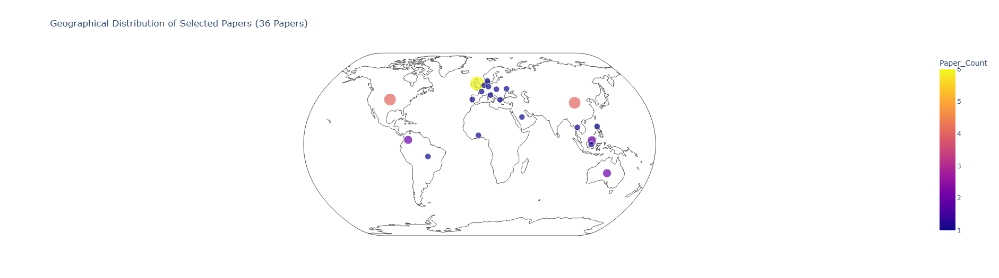
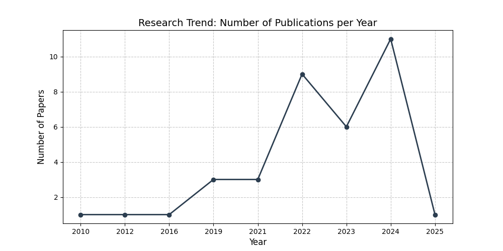
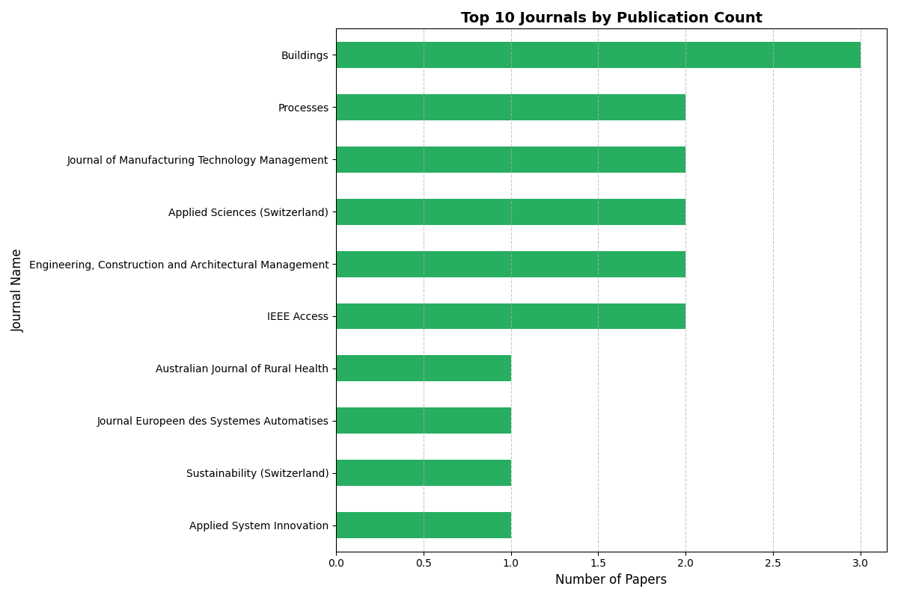

🚀 AI-Enhanced Systematic Literature Review (SLR) Automation
Project Overview
This repository focuses on enhancing the efficiency and rigor of Systematic Literature Review (SLR) through Python-based automation. Inspired by the methodological frameworks of Atkinson & Flint (2023) and the multi-agent AI concepts of Sami et al. (2025), this tool aims to bridge the gap between traditional research and modern AI capabilities.

Key Features
Automated Metadata Cleaning: Efficiently handles missing values and inconsistent data from Scopus and Web of Science (WoS) exports.

Keyword-Based Screening: Implements logic-based filtering to separate relevant papers from noise.

Summary Statistics: Generates instant inclusion/exclusion metrics (Inclusion Rate %).

Data Visualization: Automatically produces charts to visualize the screening process for research reports.

AI Agent Simulation: A conceptual architecture for multi-agent verification to ensure high-quality paper selection.

Theoretical Foundation
This project is built upon two core pillars:

Efficiency in SLR: Adopting automation to reduce human error and time consumption in large-scale dataset screening.

AI Integration: Exploring how Multi-Agent Systems can assist human researchers in verifying complex academic contexts.

📊 Execution Result
Below is the proof of concept (PoC) showing the script successfully processing dummy research data:

Roadmap & Future Work
[✅] Basic Metadata Cleaning & Filtering
[✅] Automated Summary Statistics
[✅] Data Visualization (Charts)
[✅] Integration with Large Language Models (LLMs) via API
[✅] Automated Synthesis Generation

Contact & Collaboration
I am actively developing this tool as part of my preparation for advanced research (Master/PhD). Feel free to reach out for collaboration or academic discussions!

### 📊 Research Insights (Results from 36 Selected Papers)

Below are the automated visualizations generated by the script using real metadata from Scopus:

#### **Global Research Distribution (Bubble Map)**

*The map shows research hotspots, with bubble size indicating the number of papers per country.*

#### **Publication Trends & Journal Analysis**

  
  

*Left: Yearly publication trends. Right: Top 10 journals by paper count.*
